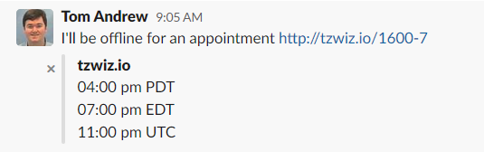

# tzwizio

tzwiz.io is a site to give you open graph meta tags that converts timezones.

This is useful within slack as it'll show various times to all users so they don't have to mentally convert timezones.

